<p align="center">
  
</p>

<p align="center">
  <a href="https://github.com/ishandutta2007/Awesome-Awesome-Awesome"></a>
  <a href="https://discord.gg/jc4xtF58Ve"></a>
  <a href="https://github.com/ishandutta2007"></a>
</p>

# 📸 Screenshot ⛶


# ✨ GitHub User Star History 🌟

[](https://www.star-history.com/#ishandutta2007/star-history-user&type=date&legend=top-left)

Ever wondered how a GitHub user's popularity has grown over time? This tool lets you generate and embed a chart of the aggregated star history of all public repositories for a given GitHub user. 🚀⭐📈

**[➡️ Live Demo](https://ishandutta2007.github.io/star-history-user/)** 🌐✨

## 🎨 Features ✨

*   **📈 User-Level Star History:** Generate a chart of the total stars for a GitHub user, aggregated across all their public repos. 🌟
*   **📊 Beautiful Charts:** Uses Chart.js to render a clean and beautiful line chart. 🎨
*   **💻 Embeddable:** The generated chart can be embedded anywhere. 🔗
*   **🚀 Fast & Lightweight:** Built with Vue.js and Vite for a fast and smooth user experience. ⚡
*   **📱 Responsive:** The chart is fully responsive and looks great on all devices. 📱💻

## 🛠️ Usage 💡

1.  Go to the **[Live Demo](https://ishandutta2007.github.io/star-history-user/)** 🌐 (or [Local url](http://localhost:5173/star-history-user/) 💻).
2.  Enter a GitHub username in the input field 👤.
3.  Click the "Generate Chart" button 🖱️.
4.  Voila! You have the star history of the user. ✨🎉

## 💻 Tech Stack ⚙️

*   [Vue.js](https://vuejs.org/) 🟢
*   [Vite](https://vitejs.dev/) ⚡
*   [Chart.js](https://www.chartjs.org/) 📊
*   [GitHub API](https://docs.github.com/en/rest) 🐙

## 🔧 Project Setup 🚀

Create a `.env` file in project root with following 📝:
```
VITE_GITHUB_TOKEN=<Your-github-access-token>
```

To generate GitHub access token follow [this guide](https://docs.github.com/en/authentication/keeping-your-account-and-data-secure/managing-your-personal-access-tokens) 🔑.


```sh
npm install
```

### ⚡ Compile and Hot-Reload for Development

```sh
npm run dev
```

### 📦 Compile and Minify for Production

```sh
npm run build
```

## 🙌 Contributing 🤝

We welcome contributions from the community! If you'd like to contribute, please read our [Contributing Guide](CONTRIBUTING.md) 📜 and our [Code of Conduct](CODE_OF_CONDUCT.md) 🛡️.

## 💬 Community & Support 🌐

*   **📚 [Documentation](https://docs.open-workflows.com):** Check out our official documentation for detailed guides and tutorials. 📖
*   **🗣️ [Forum](https://community.open-workflows.com):** Join our community forum to ask questions, share your projects, and connect with other users. 💬
*   **💬 [Discord](https://discord.com/invite/jc4xtF58Ve):** Chat with us on Discord for real-time support and discussions. 👾
*   **🐦 [Twitter](https://twitter.com/ishandutta2007):** Follow us on Twitter for the latest news and updates. 🐥
*   **🐙 [Github](https://github.com/ishandutta2007):** Follow me on Github for the latest commits and updates. ⭐


## 💖 Support & Sponsorship 🎁

If you find this project helpful or if it has saved you time and resources, please consider sponsoring the development. Your support helps maintain the project, develop new features, and keep the initiative open-source. 🙏

**[Sponsor @ishandutta2007 on GitHub](https://github.com/sponsors/ishandutta2007)** 💖

Every contribution, no matter how small, makes a huge difference! 🚀✨

## 📈 Star History
[](https://star-history.dera.page/#ishandutta2007/star-history-user&type=date&legend=top-left)
